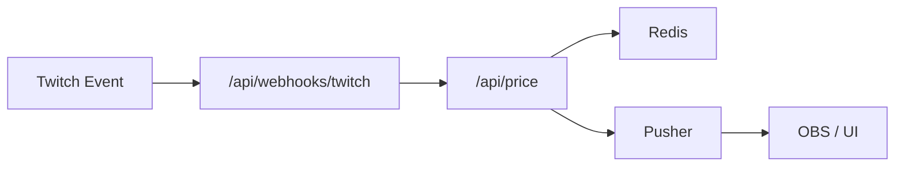
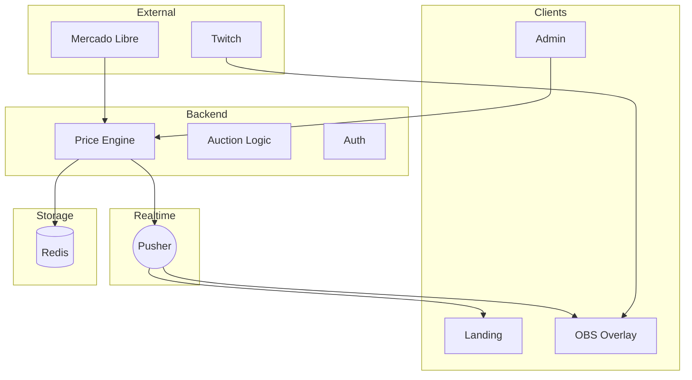

# 🎮 LuisHongo: Reverse Auction System

[](https://tu-proyecto.vercel.app)
[](https://nextjs.org/)
[](https://twitch.tv/LuisHongo)

> **"Turning Gaming into a Gamified Marketplace."**

Este proyecto es una plataforma full-stack diseñada para gestionar la dinámica de mi regreso a Twitch. Permite a mis moderadores y a la propia API de Twitch controlar el progreso de los juegos y ajustar dinámicamente el precio de venta de mis juegos físicos en tiempo real.

Es un sistema de subasta inversa en tiempo real diseñado para streams de alto impacto. Los espectadores controlan el precio final mediante interacciones directas en Twitch, sincronizando una publicación de **Mercado Libre** en el clímax del evento.

---

## 🚀 La Dinámica: "Subasta Inversa"

A diferencia de una subasta tradicional donde el precio sube, aquí **la comunidad trabaja unida para bajarlo**.

### Reglas del Juego:

1. **Precio de Salida:** La subasta inicia en un precio base (ej. $1,200 MXN).

2. **Mecánica de Descuento:** Cada interacción en el chat de Twitch reduce el precio en tiempo real:

   * **Suscripción Tier 1 / Prime:** Descuento principal
   * **Suscripción Tier 2 / 3:** Descuento premium
   * **Bits:** Descuento proporcional a la cantidad (100, 500, 1000 bits)
   * **Follows:** Micro-descuento controlado (anti-abuso)

3. **Fases de Escalamiento:**
   El sistema detecta el precio y entra en diferentes niveles (Base, Nivel 1, 2, 3 y Modo Final).
   En cada nivel, los descuentos se vuelven **más agresivos**, premiando la constancia de la comunidad.

4. **El Clímax:**
   Al finalizar, el bot libera automáticamente el link de Mercado Libre con el precio final alcanzado.

---

## 🛠️ Stack Tecnológico

* **Framework:** Next.js 14+ (App Router)
* **Database & State:** Upstash Redis
* **Real-time:** Pusher (WebSockets)
* **Auth:** Auth.js (NextAuth) + Twitch + RBAC
* **Animaciones:** Framer Motion
* **Deployment:** Vercel (Edge Functions)

---

## 🛠️ Replicación de Base de Datos (Redis)

Si deseas desplegar tu propia instancia, asegúrate de inicializar las siguientes llaves:

| Llave                  | Tipo   | Descripción                             |
| ---------------------- | ------ | --------------------------------------- |
| `auction_price`        | String | Precio actual                           |
| `auction_status`       | String | Estado (`active`, `paused`, `finished`) |
| `game_progress`        | String | Progreso visual (0-100)                 |
| `ml_access_token`      | String | Token Mercado Libre                     |
| `ml_refresh_token`     | String | Refresh token                           |
| `final_price_achieved` | String | Precio final guardado                   |

---

## 🔐 Autenticación con Twitch + EventSub (CRÍTICO)

⚠️ **Este paso es obligatorio para que el sistema funcione en producción.**

Iniciar sesión con Twitch **NO es suficiente**.
Debes registrar las suscripciones de eventos (EventSub) manualmente vía API.

---

### 🧠 ¿Qué hace esto?

El endpoint:

```
/api/twitch/register-eventsub
```

Se encarga de:

* Crear suscripciones EventSub para:

  * `channel.follow`
  * `channel.subscribe`
  * `channel.subscription.message`
  * `channel.subscription.gift`
  * `channel.cheer`
* Conectar esos eventos al webhook:

  ```
  /api/webhooks/twitch
  ```
* Permitir que Twitch envíe eventos en tiempo real

---

### ⚙️ Paso obligatorio después del login

Después de autenticarte con Twitch:

```
POST /api/twitch/register-eventsub
```

Ejemplo:

```js
fetch("/api/twitch/register-eventsub", { method: "POST" })
  .then(res => res.json())
  .then(console.log);
```

---

### ✅ Validación

#### Estado general

```
/api/twitch/status
```

Debe devolver:

```json
{
  "connection": "CONNECTED",
  "eventsub": {
    "enabled": 5,
    "pending": 0,
    "ok": true
  }
}
```

#### Estado detallado

```
/api/twitch/eventsub/status
```

Todos los eventos deben estar en:

```
"status": "enabled"
```

---

### 🚨 Problemas comunes

| Problema         | Causa                           |
| ---------------- | ------------------------------- |
| 405              | Usaste GET en vez de POST       |
| pending          | Webhook inválido (URL o HTTPS)  |
| total: 0         | No ejecutaste register-eventsub |
| No bajan precios | NEXTAUTH_URL mal configurado    |

---

### 🧪 Flujo completo



---

### 🧨 TL;DR

Si no ejecutas:

```
/api/twitch/register-eventsub
```

👉 **Tu sistema NO reaccionará a subs, bits o follows.**

---

## 🏗️ Arquitectura del Sistema


